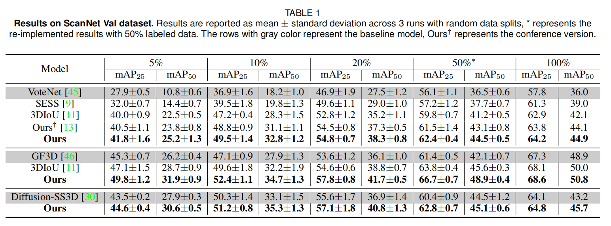
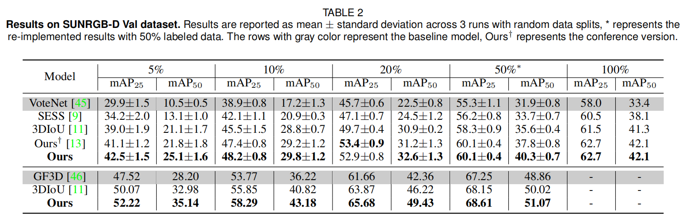
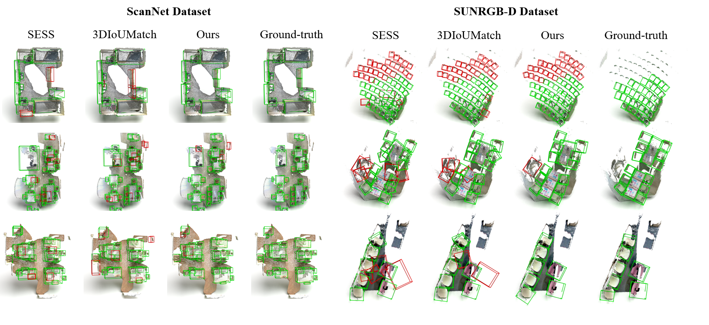

## Not Every Side Is Equal: Localization Uncertainty Estimation for Semi-Supervised 3D Object Detection
This repository contains an implementation of Nesie, a Semi-Supervised 3D Object Detection method introduced in our paper:

[[Project Webpage](https://chuxwa.github.io/Nesie/)]
[[Paper](https://openaccess.thecvf.com/content/ICCV2023/papers/Wang_Not_Every_Side_Is_Equal_Localization_Uncertainty_Estimation_for_Semi-Supervised_ICCV_2023_paper.pdf)]

## News
* **18. July 2023**: Nesie is accepted at ICCV 2023. 
* **October 2023**: [Nesie PDF](https://openaccess.thecvf.com/content/ICCV2023/papers/Wang_Not_Every_Side_Is_Equal_Localization_Uncertainty_Estimation_for_Semi-Supervised_ICCV_2023_paper.pdf) released.
* **December 2023**: Code (Nesie) for ScanNet dataset released.
* **May 2024**: Code (SAQE) for ScanNet dataset released. :fire:

## Todo
- [&#10004;] Code (Nesie) for ScanNet dataset.
- [&#10004;] Code (SAQE) for ScanNet dataset.
- [ ] Code (Nesie) for SunRGB-D dataset.
- [ ] Code (SAQE) for SunRGB-D dataset.

## Installation
Please following the [env_setup.sh](env_setup.sh)

## Getting Started
We follow the `mmdetection3d` data preparation protocol described in [scannet](data/scannet), [sunrgbd](data/sunrgbd).

**Pre-training**

To start pre-training, run with `Nesie` [configs](configs/Nesie) or `SAQE` [configs](configs/SAQE):
```shell
CUDA_VISIBLE_DEVICES=$gpu_id OMP_NUM_THREADS=24 \
python tools/train.py \
configs/Nesie(SAQE)/nesie(saqe)-votenet-scannet-pretrain-$Ratio.py \
--gpu-ids 0 
```

**Training**

To start training, run with `Nesie` [configs](configs/Nesie) or `SAQE` [configs](configs/SAQE):
```shell
CUDA_VISIBLE_DEVICES=$gpu_id OMP_NUM_THREADS=24 \
python tools/train.py \
configs/Nesie(SAQE)/nesie(saqe)-votenet-scannet-train-$Ratio.py \
--gpu-ids 0 \
--load-from work_dirs/nesie(saqe)-votenet-scannet-pretrain-$Ratio/epoch_36.pth
```

**Testing**

Test model using with `Nesie` [configs](configs/Nesie) or `SAQE` [configs](configs/SAQE):
```shell
CUDA_VISIBLE_DEVICES=$gpu_id OMP_NUM_THREADS=24 \
python tools/test.py \
configs/Nesie(SAQE)/nesie(saqe)-votenet-scannet-test.py \
work_dirs/nesie(saqe)-votenet-scannet-train-$Ratio/epoch_36.pth --eval mAP --seed 9
```

## Results

**Comparison with state-of-the-art methods on ScanNet dataset.**
Ours† represents the Nesie version and Ours represents the SAQE version.
<p align="center"></p>

**Comparison with state-of-the-art methods on SunRGBD dataset.**
Ours† represents the Nesie version and Ours represents the SAQE version.
<p align="center"></p>

**Visulization of Detection Results**

<p align="center"></p>

## Citation

If you find this work useful for your research, please cite our paper:
```
@InProceedings{Wang_2023_ICCV,
    author    = {ChuXin Wang and Wenfei Yang and Tianzhu Zhang},
    title     = {Not Every Side Is Equal: Localization Uncertainty Estimation for Semi-Supervised 3D Object Detection},
    booktitle = {Proceedings of the IEEE/CVF International Conference on Computer Vision (ICCV)},
    month     = {October},
    year      = {2023},
}
```
